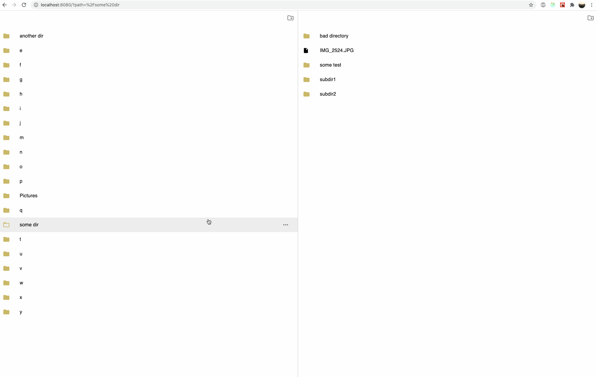

## File Manager (in progress)
Browse your files using File Manager!



**@Copyright and credits for UI design idea go to Apple (MacOS Finder app)!**

## Usage
```js
    import FileManager from 'file-manager';
    ...
    <FileManager serverApi="https://your-host.com/maybe-prefix" /> 
```

Set your `serverApi` prop and serve your files based on the following API URLs:

- `GET [serverApi]/directories?path=/relative/dir/path&withParents=true|false` to return a directory, and if `withParents=true` return an array of directories.
- `POST [serverApi]/directories?path=/relative/dir/path` to create a directory at the given path
- `DELETE [serverApi]/directories?path=/relative/dir/path` to delete a directory
- `GET [serverApi]/files?path=/relative/file/path` to get a file
- `POST [serverApi]/files?path=/relative/dir/path` to upload one or more files (when files are dropped into the directory). Get it from the `request.files.files` variable.
- `DELETE [serverApi]/files?path=/relative/dir/or/file/path` to delete a file

## Stack
Built with React, Redux, TypeScript, Webpack & Eslint

## TODO
- renaming of files & directories
- code refactor and optimizations

## Licence
MIT
